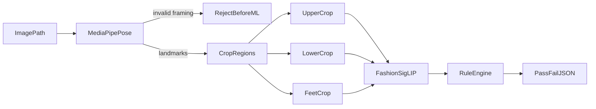

# Attire Verification — Agent Prompt

Copy the **Agent instruction** section below into Cursor Agent mode (with this UV project open) to implement the BR attire verification eval CLI from scratch.

---

## How to use

1. Open `/Volumes/T7-Dev/attire_verification` in Cursor.
2. Copy everything inside the fenced block under **Agent instruction** (from the opening line through the acceptance checklist).
3. Paste into a new Agent chat and run.

After implementation, use the **Quick reference** at the bottom of this file.

---

## Agent instruction

```
Implement a BR attire verification CLI in this UV Python project (`attire-verification`, Python >= 3.12).

## Goal

Given a full-body BR attire photo:
1. Validate framing with MediaPipe Pose
2. Crop upper body, lower body, and feet using pose landmarks
3. Score each crop with Marqo FashionSigLIP zero-shot labels
4. Apply a unified dress-code rule engine (no region split)
5. Return pass/fail/uncertain with per-region scores as JSON

This is an offline eval tool only — not a production API, not Flutter integration, not model training.

## Architecture

ImagePath -> MediaPipePose -> (invalid framing -> REJECTED)
                         -> CropRegions (upper, lower, feet, optional chest)
                         -> FashionSigLIP per crop
                         -> RuleEngine
                         -> PassFailJSON

## Out of scope (do NOT build)

- Flutter / mobile app changes
- Backend API (Nest, etc.)
- Fine-tuning or training CLIP/ViT
- Face matching
- Dedicated ID badge detector (v1: optional chest-crop SigLIP label only)

## Project layout

Create this structure under the repo root:

attire_verification/
  pyproject.toml
  README.md
  AGENT_PROMPT.md          (already exists — do not delete)
  src/attire_verification/
    __init__.py
    __main__.py            # entry: uv run python -m attire_verification
    cli.py                   # typer CLI: verify, batch
    pose_cropper.py          # MediaPipe Pose + crop boxes
    siglip_scorer.py         # Marqo FashionSigLIP inference
    labels.py                # text label lists per region
    rules.py                 # dress-code rule engine
    models.py                # pydantic (or dataclass) result schemas
  tests/
    test_rules.py            # unit tests for rules only (no GPU needed)

Remove or repurpose the stub `main.py` at repo root — prefer `python -m attire_verification` as the entry point. Update `pyproject.toml` with `[project.scripts]` or package config as needed.

## Dependencies (add via uv)

Run:
  uv add mediapipe opencv-python-headless pillow open-clip-torch torch numpy pydantic typer

CPU inference is fine for eval. Use CUDA if available automatically (torch.cuda.is_available()).

## CLI

Implement two commands:

### verify — single image

  uv run python -m attire_verification verify --image "/path/to/photo.jpg"
  uv run python -m attire_verification verify --image photo.jpg --pretty
  uv run python -m attire_verification verify --image photo.jpg --debug-crops ./debug/

Flags:
  --image PATH          (required) input image
  --pretty              pretty-print JSON to stdout
  --debug-crops DIR     save cropped region JPEGs for inspection
  --min-confidence F    override default 0.55 threshold (optional)
  --min-margin F        override default 0.08 top1-top2 margin (optional)

Print JSON to stdout. Exit code 0 for PASSED, 1 for FAILED/UNCERTAIN/REJECTED (document in README).

### batch — folder eval

  uv run python -m attire_verification batch \
    --dir "/Users/afridee/Downloads/BR Attire Verification_Sample Photos" \
    --output results.jsonl

For each image under --dir (recursive, *.jpg *.jpeg *.png):
  - Run verify pipeline
  - Infer ground truth from parent folder name:
      "Right Attire"  -> expected PASSED
      "Wrong Attire"  -> expected FAILED
  - Append one JSON line per image to --output
  - Print summary: accuracy, false pass count, false fail count, rejected count

## Step 1 — MediaPipe Pose cropper (`pose_cropper.py`)

Use MediaPipe Pose (Tasks API or classic solutions — pick one that works on Python 3.12).

From 33 pose landmarks, derive padded bounding boxes in pixel coords:

| Region | Landmarks | Padding |
|--------|-----------|---------|
| upper  | left/right shoulder to left/right hip | 10% each side |
| lower  | hips to ankles | 5% |
| feet   | ankles to image bottom | 10% |
| chest  | shoulders + upper 40% of torso (optional) | 5% |

Clamp all boxes to image bounds. Convert normalized landmarks to pixels using image width/height.

### Framing gate (before ML)

Return status REJECTED (not FAILED) if any:
  - no person / pose not detected
  - nose landmark not visible (visibility < 0.5 if available)
  - both ankles not visible or too low confidence
  - vertical span nose-to-ankle < 55% of image height (person too small / not full body)

On REJECTED, return JSON immediately:
  {
    "status": "REJECTED",
    "failReasons": ["incomplete_body_in_frame"],
    "regions": null,
    "pose": { "fullBodyOk": false, ... }
  }

## Step 2 — FashionSigLIP scorer (`siglip_scorer.py`)

Model: Marqo/marqo-fashionSigLIP
  - Prefer loading via open_clip with Marqo's published weights, OR HuggingFace if simpler.
  - Cache text embeddings for all labels at startup (encode once per region label set).

For each crop image:
  1. Encode image -> embedding
  2. Cosine similarity vs each text label embedding
  3. Softmax over similarities -> probabilities
  4. Return top-3 labels with scores

Expose:
  score_crop(crop_pil: Image, labels: list[str]) -> RegionScore
  where RegionScore = { topLabel, topScore, secondLabel, secondScore, scores: {label: float} }

## Step 3 — Label sets (`labels.py`)

Fixed unified dress code (no region split). Use these exact strings:

UPPER_LABELS = [
  "white formal button-down shirt",
  "light blue formal button-down shirt",
  "official company polo shirt",
  "casual t-shirt",
  "striped t-shirt",
  "plaid or checkered shirt",
  "non-official colored polo shirt",
]

LOWER_LABELS = [
  "black formal trousers",
  "dark navy trousers",
  "beige or tan chinos",
]

FEET_LABELS = [
  "black formal closed shoes",
  "black leather loafers",
  "white sneakers",
  "sandals or slides",
]

CHEST_LABELS = [
  "blue lanyard with ID badge visible",
  "no ID badge visible",
]

Map topLabel strings to internal enums in rules.py (e.g. ShirtType, TrouserType, FootwearType).

## Step 4 — Rule engine (`rules.py`)

Constants (configurable via CLI flags):
  MIN_CONFIDENCE = 0.55
  MIN_MARGIN = 0.08   # top1 - top2 must exceed this or -> UNCERTAIN

### Auto FAIL if ANY:
  - upper enum in { CASUAL_TEE, STRIPED, PLAID, NON_OFFICIAL_POLO }
  - feet enum == SANDALS
  - lower enum == BEIGE_CHINOS

Add failReason codes:
  - casual_shirt
  - open_footwear
  - wrong_trousers
  - non_official_polo

### Auto PASS if ALL:
  - upper enum in { WHITE_FORMAL, LIGHT_BLUE_FORMAL, OFFICIAL_POLO } AND topScore >= MIN_CONFIDENCE
  - lower enum in { BLACK_TROUSERS, NAVY_TROUSERS } AND topScore >= MIN_CONFIDENCE
  - feet enum in { FORMAL_CLOSED, LOAFERS } AND topScore >= MIN_CONFIDENCE

### UNCERTAIN if:
  - any region topScore < MIN_CONFIDENCE
  - any region (topScore - secondScore) < MIN_MARGIN
  - feet enum == SNEAKERS (borderline — do not auto-pass sneakers in v1)

failReason for UNCERTAIN: ["low_confidence"] or ["borderline_footwear"]

### Status values
  PASSED | FAILED | UNCERTAIN | REJECTED

## Step 5 — Output schema (`models.py`)

Example successful verify output:

{
  "status": "FAILED",
  "failReasons": ["open_footwear", "casual_shirt"],
  "imagePath": "/path/to/photo.jpg",
  "regions": {
    "upper": {
      "topLabel": "striped t-shirt",
      "topScore": 0.81,
      "secondLabel": "casual t-shirt",
      "secondScore": 0.12,
      "scores": { "...": 0.81 }
    },
    "lower": { "topLabel": "black formal trousers", "topScore": 0.74, ... },
    "feet": { "topLabel": "sandals or slides", "topScore": 0.88, ... },
    "chest": { "topLabel": "blue lanyard with ID badge visible", "topScore": 0.65, ... }
  },
  "pose": {
    "fullBodyOk": true,
    "landmarksDetected": 33,
    "cropBoxes": {
      "upper": [x, y, w, h],
      "lower": [x, y, w, h],
      "feet": [x, y, w, h]
    }
  }
}

Use pydantic models for type safety. Serialize with model_dump().

## Step 6 — README.md

Document:
  - uv sync / uv run setup
  - verify and batch commands
  - exit codes
  - sample photos path for testing
  - note: first run downloads FashionSigLIP weights (~150MB+)

## Test data

Sample photos (for manual + batch testing):
  /Users/afridee/Downloads/BR Attire Verification_Sample Photos/Right Attire/
  /Users/afridee/Downloads/BR Attire Verification_Sample Photos/Wrong Attire/

Before finishing, run verify on:
  - at least one Wrong Attire image with sandals/casual shirt -> expect FAILED
  - at least one Right Attire image with formal wear -> expect PASSED or UNCERTAIN (not false FAIL on footwear)

## tests/test_rules.py

Unit test the rule engine with mocked RegionScore dicts — no torch/mediapipe in tests:
  - sandals + striped shirt -> FAILED
  - white shirt + black trousers + loafers with high scores -> PASSED
  - low confidence -> UNCERTAIN
  - sneakers -> UNCERTAIN

## Acceptance checklist

- [ ] uv run python -m attire_verification verify --image ... prints valid JSON
- [ ] Wrong sample with sandals -> FAILED + open_footwear in failReasons
- [ ] Right sample with formal wear -> PASSED or UNCERTAIN (not false FAIL)
- [ ] --debug-crops saves upper/lower/feet JPEGs
- [ ] batch mode writes results.jsonl + prints accuracy summary
- [ ] No hardcoded absolute paths in source (CLI defaults ok in README only)
- [ ] README with install + examples
- [ ] test_rules.py passes: uv run pytest

Keep code minimal and readable. Match existing UV project conventions. Do not over-engineer.
```

---

## Quick reference (after implementation)

```bash
cd /Volumes/T7-Dev/attire_verification

# Install deps
uv sync

# Single image
uv run python -m attire_verification verify \
  --image "/Users/afridee/Downloads/BR Attire Verification_Sample Photos/Wrong Attire/DHKN-1.jpeg" \
  --pretty

# Save debug crops
uv run python -m attire_verification verify \
  --image "/Users/afridee/Downloads/BR Attire Verification_Sample Photos/Right Attire/DHKN-1.jpeg" \
  --debug-crops ./debug/

# Batch eval on all 50 sample photos
uv run python -m attire_verification batch \
  --dir "/Users/afridee/Downloads/BR Attire Verification_Sample Photos" \
  --output results.jsonl

# Run rule unit tests
uv run pytest
```

### Expected status values

| Status | Meaning |
|--------|---------|
| `PASSED` | Meets unified dress code |
| `FAILED` | Clear violation (sandals, casual shirt, etc.) |
| `UNCERTAIN` | Low confidence or borderline (e.g. sneakers) — not a pass |
| `REJECTED` | Bad photo framing — retake, not an attire fail |

### Architecture diagram


